Cel
===

Predykcja pogody na podstawie danych historycznych

- Normalnie pogodę prognozuje się numerycznie rozwiązując równania dynamiki atmosfery i termodynamiki na siatce 3D w czasie.
- My chcemy podjąć próbę modelowania pogody jako szereg czasowy.
- I zobaczyć jak dużo (czy cokolwiek) ponad losowy szum da się w ten sposób przewidzieć.

Dane
====

- [Meteostat](https://dev.meteostat.net/python)
- Predykcje robimy dla stacji Wrocław.
- Używamy też danych z czterech sąsiednich stacji: Opole, Legnica, Kłodzko, Poznań.


<!-- cmd: column_layout: [1, 1] -->
<!-- cmd: column: 0 -->
- **temp** = Temperatura powietrza
- **rhum** = Wilgotność względna
- **prcp** = Opady (godzinowa suma)
- **snwd** = Głębokość pokrywy śnieżnej
- **wdir** = Kierunek wiatru
- **wspd** = Średnia prędkość wiatru
<!-- cmd: column: 1 -->
- **wpgt** = Szczytowy poryw wiatru
- **pres** = Ciśnienie atmosferyczne
- **tsun** = Czas nasłonecznienia
- **cldc** = Zachmurzenie ogólne
- **coco** = Kod warunków pogodowych
<!-- cmd: reset_layout -->

Definicja zadania
=================

Ograniczyliśmy problem prognozy do dwóch zadań:

1. Prognoza średniej temperatury na kolejny dzień i na kolejną noc (regresja)
    - "prognoza na następne pół dnia"
2. Prognoza "czy następnego dnia będzie padać" (klasyfikacja)

Eksploracyjna analiza danych
============================

EDA - braki
===========

<!-- cmd: column_layout: [1, 1] -->
<!-- cmd: column: 0 -->
Procent braków w kolumnach
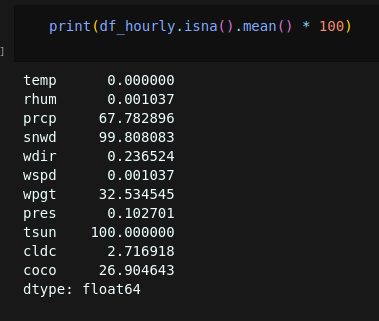
<!-- cmd: column: 1 -->
Brakujące time-stampy

<!-- cmd: reset_layout -->

EDA - braki
===========

Braki w kolumnach vs lata

-> Niektóre rzeczy zaczęto rejestrować dopiero od jakiegoś czasu

EDA - braki
===========

Czy użyć danych dziennych do prognozy deszczu?

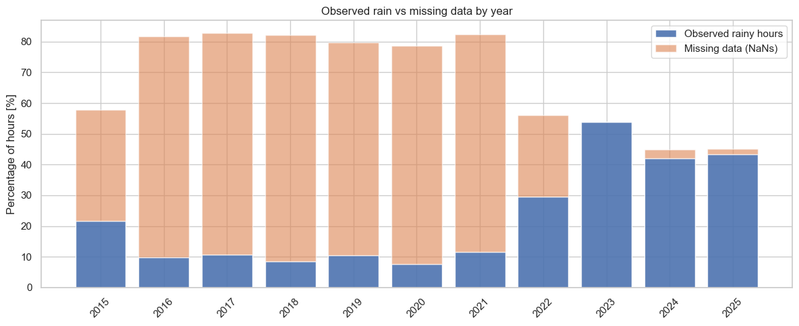

-> Nie...

Co zrobiliśmy z brakami
=======================

- Do prognozy deszczu wzięliśmy dane od 2022 (bo wcześniej nie było żadnych danych o deszczu)
- Do prognozy temperatury od 2018 - potem braków jest już w miarę mało
- Brakujące indeksy dodaliśmy z wartościami NaN, a potem braki w kolumnach uzupełniliśmy według tych zasad:
  - **temp** - jak godzinę temu
  - **rhum** - jak godzinę temu
  - **prcp** - 0
  - **snwd** - 0
  - **wdir** - jak godzinę temu
  - **wspd** - jak godzinę temu
  - **wpgt** - jak **wspd**
  - **pres** - jak godzinę temu
  - **tsun** - usuń całą kolumnę
  - **cldc** - jak godzinę temu
  - **coco** - jak godzinę temu, a braki na początku danych 0

EDA - temperatura
=================

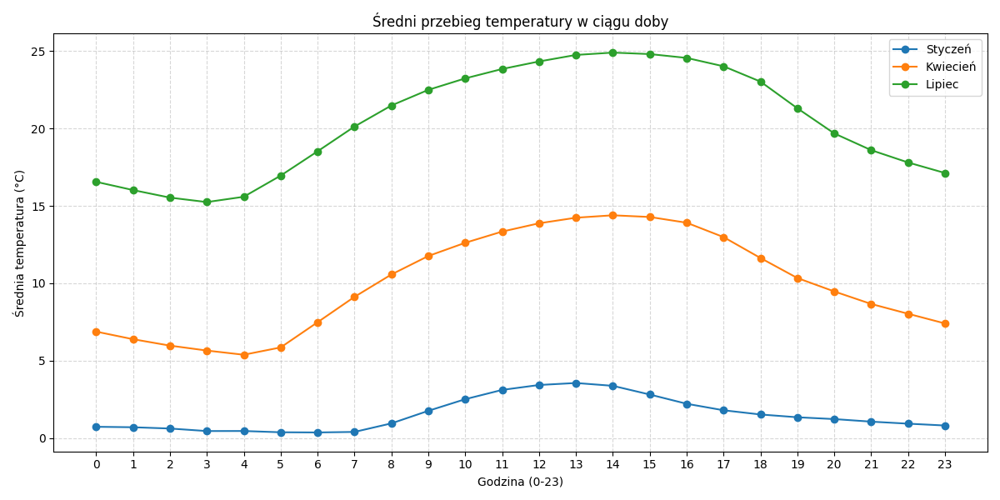

<!-- EDA - temperatura
=================

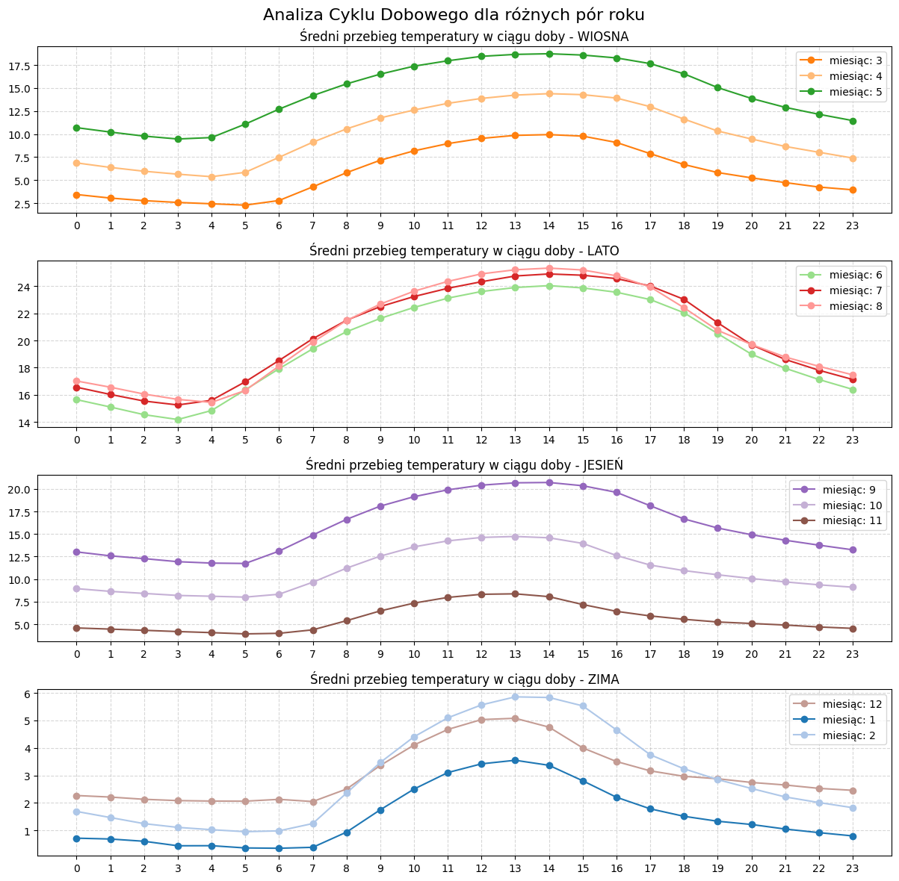 -->

EDA - temperatura
=================

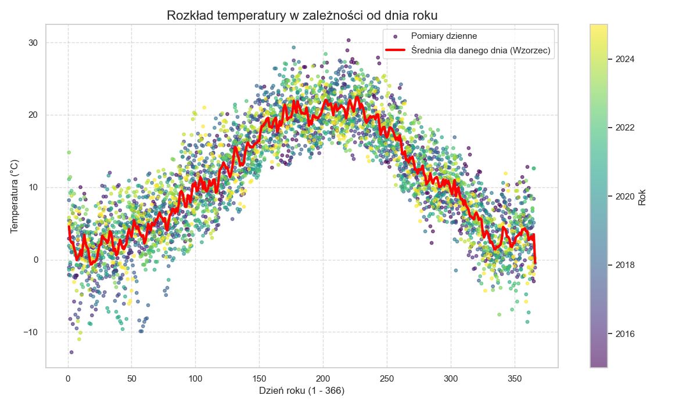

EDA - temperatura
=================

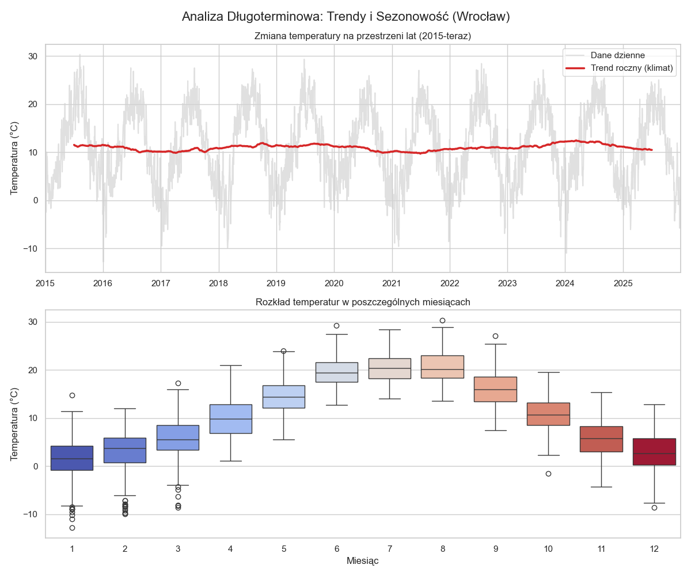

EDA - deszcz
============

<!-- cmd: column_layout: [1, 1] -->
<!-- cmd: column: 0 -->
Ilość deszczu vs miesiąc
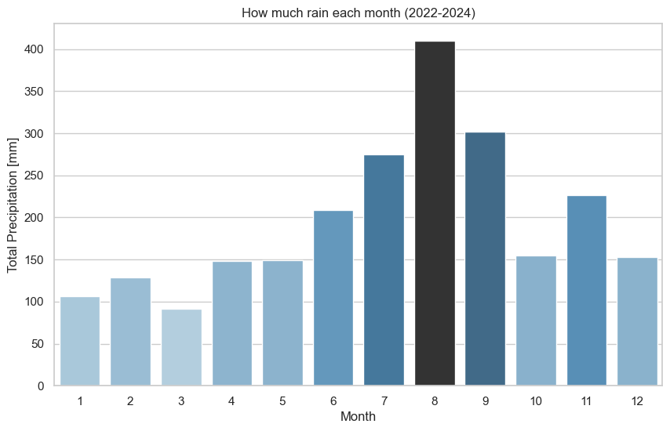

<!-- cmd: column: 1 -->
Częstość deszczu vs miesiąc
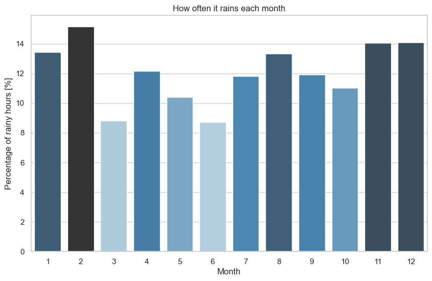

<!-- cmd: reset_layout -->

EDA - deszcz
============

Kiedy w ciągu dnia pada?

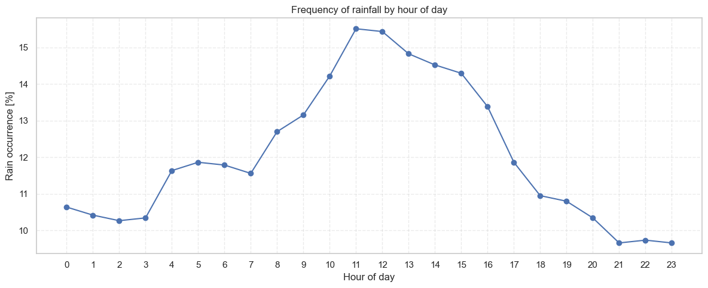

Predykcja temperatury
=====================

- Zbiór testowy to ostatni rok w danych

- Porównujemy RMSE, MAE, R2

- MAE vs miesiąc - w których miesiącach bardziej się mylimy

- Osobna ewaluacja dla predykcji dnia i predykcji nocy - czy bardziej mylimy się w nocy czy w dzień

Predykcja temperatury
=====================

### Modele baseline dla predykcji temperatury

1. Pogoda jutro będzie taka sama jak dzisiaj
2. Pogoda zawsze jest jakąś średnią z aktualnego miesiąca
3. Pogoda składa się z trendu globalnego (dopasowania regresji), trendu sezonowego (pora roku), lokalnego (dzień vs noc) i z losowego szumu

```txt
--- Baseline 1: Persistence ---
[Day  ] RMSE: 2.87, MAE: 2.22, R2: 0.89
[Night] RMSE: 2.96, MAE: 2.31, R2: 0.83

--- Baseline 2: Monthly Average ---
[Day  ] RMSE: 4.21, MAE: 3.44, R2: 0.76
[Night] RMSE: 3.77, MAE: 3.01, R2: 0.73

--- Baseline 3: Decomposition (+Noise) ---
[Day  ] RMSE: 6.07, MAE: 4.95, R2: 0.50
[Night] RMSE: 5.51, MAE: 4.41, R2: 0.43
```
<!--
---

 MAE vs miesiąc dla baseline 1 i 3

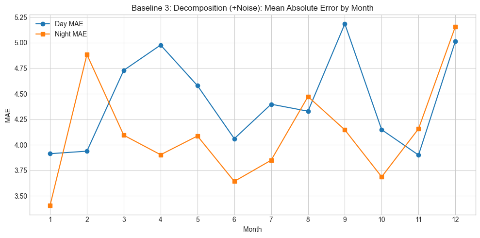

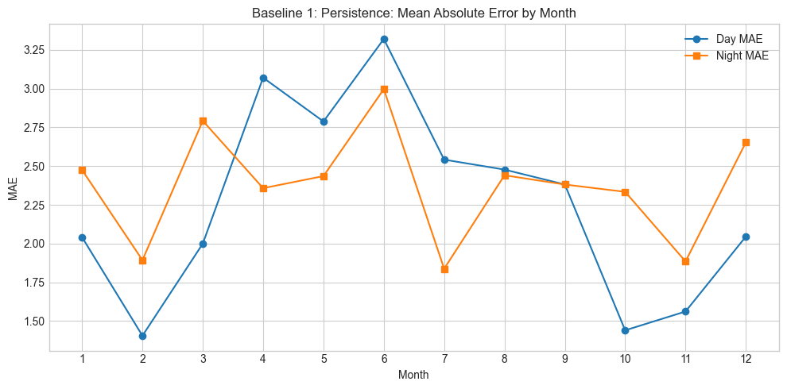 -->

Predykcja temperatury XGBoost (v1)
==================================

### Feature engineering - wariant 1

**Lag features:**

- `temp_lag_{1,3,6,12,24}h`
- `pres_lag_{1,3,6,12,24}h`
- `rhum_lag_{1,3,6,12,24}h`
- `wspd_lag_{1,3,6,12,24}h`  

**Trendy:**

- `temp_trend_3h`, `temp_trend_12h`
- `pres_trend_6h`, `pres_trend_24h`  

**Statystyki kroczące:**

- `temp_mean_{6,24}h`, `temp_std_{6,24}h`
- `pres_mean_{6,24}h`, `pres_std_{6,24}h`  

**Czas:**

- `day_year_sin`, `day_year_cos`
- `month`

**Inne:**

- `dew_point_approx` - przybliżony punkt rosy
- `wdir_sin`, `wdir_cos` - reprezentacja kołowa kierunku wiatru

<!-- 
Predykcja temperatury XGBoost (v1)
==================================

### Wariant 1 wyniki

```txt
[MODEL DNIA] RMSE: 2.67°C | MAE: 2.11°C | R2: 0.8954
[MODEL NOCY] RMSE: 1.48°C | MAE: 1.15°C | R2: 0.9545
```

Predykcja temperatury XGBoost (v1)
==================================

### Wariant 1 wyniki

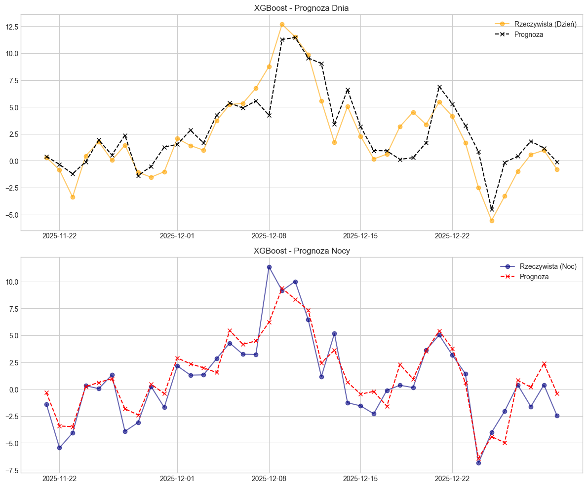

Predykcja temperatury XGBoost (v1)
==================================

### Wariant 1 wyniki

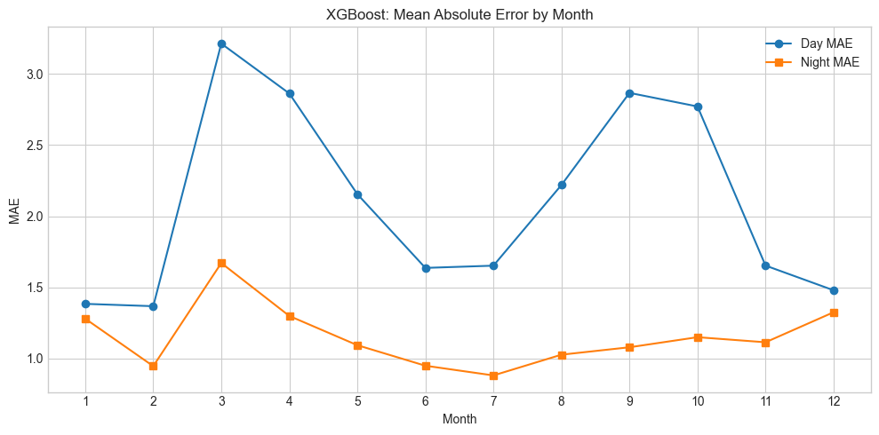
-->

Predykcja temperatury XGBoost (v2)
==================================

### Feature engineering - wariant 2

**Snapshot (stan w ostatniej godzinie przed startem prognozy):**

- `temp_now` - temperatura
- `pres_now` - ciśnienie atmosferyczne
- `rhum_now` - wilgotność względna
- `wspd_now` - prędkość wiatru
- `cldc_now` - zachmurzenie
- `prcp_now` - opad

**Trendy czasowe:**

- `temp_trend_1h` - zmiana temperatury w ciągu ostatniej godziny
- `temp_trend_3h` - zmiana temperatury w ciągu ostatnich 3 godzin
- `pres_trend_3h` - zmiana ciśnienia w ciągu ostatnich 3 godzin  

**Cechy fizyczne:**

- `dew_point_approx` - przybliżony punkt rosy (funkcja temperatury i wilgotności)

**Czas (cykliczny):**

- `day_of_year_sin`, `day_of_year_cos` - sezonowość roczna
- `month` - miesiąc jako cecha dyskretna

Predykcja temperatury XGBoost (v2)
==================================

Wyniki wariant 1

```txt
[MODEL DNIA] RMSE: 2.67°C | MAE: 2.11°C | R2: 0.8954
[MODEL NOCY] RMSE: 1.48°C | MAE: 1.15°C | R2: 0.9545
```

Wyniki wariant 2

```txt
[MODEL DNIA] RMSE: 2.36°C | MAE: 1.85°C | R2: 0.9180
[MODEL NOCY] RMSE: 1.46°C | MAE: 1.11°C | R2: 0.9556
```

Predykcja temperatury XGBoost (v2)
==================================

### Wariant 2 wyniki


Predykcja temperatury XGBoost (v2)
==================================

### Wariant 2 wyniki

<!-- cmd: column_layout: [1, 1] -->
<!-- cmd: column: 0 -->
Feature importance (dzień)
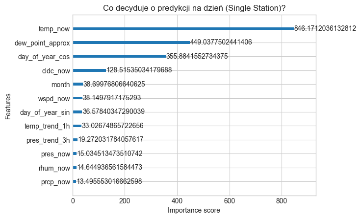

<!-- cmd: column: 1 -->
Feature importance (noc)
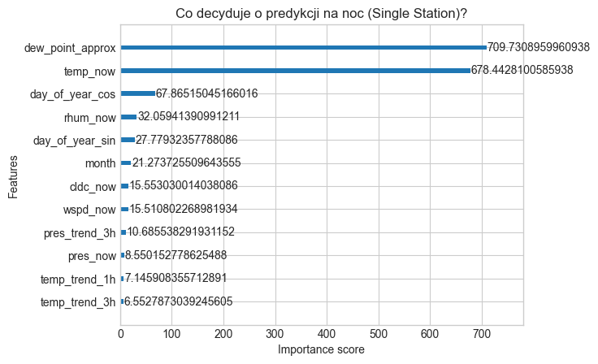
<!-- cmd: reset_layout -->

Predykcja temperatury XGBoost (v2)
==================================

### Wariant 2 wyniki

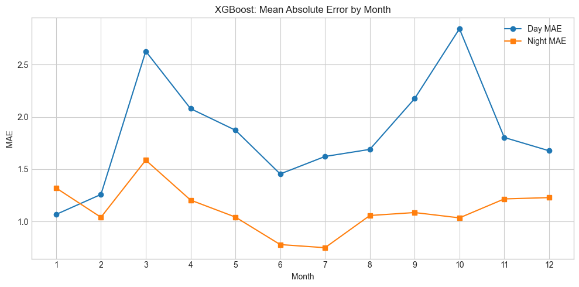

Predykcja temperatury XGBoost (v3)
==================================

### Features wariant 3 - dane z sąsiednich stacji

**Snapshot (stacja bazowa godzina przed początkiem prognozy):**

- `temp_start` - temperatura
- `pres_start` - ciśnienie
- `rhum_start` - wilgotność
- `wspd_start` - prędkość wiatru

**Gradienty przestrzenne:**

- `diff_temp_<city>` - różnica temperatury między sąsiednią stacją a bazową  
- `diff_pres_<city>` - różnica ciśnienia  

**Kierunek wiatru:**

- `wdir_sin`, `wdir_cos`

**Czas:**

- `day_of_year_sin`, `day_of_year_cos`

Predykcja temperatury XGBoost (v3)
==================================

Wyniki wariant 1

```txt
[MODEL DNIA] RMSE: 2.67°C | MAE: 2.11°C | R2: 0.8954
[MODEL NOCY] RMSE: 1.48°C | MAE: 1.15°C | R2: 0.9545
```

Wyniki wariant 2

```txt
[MODEL DNIA] RMSE: 2.36°C | MAE: 1.85°C | R2: 0.9180
[MODEL NOCY] RMSE: 1.46°C | MAE: 1.11°C | R2: 0.9556
```

Wyniki wariant 3

```txt
[MODEL DNIA] RMSE: 1.97°C | MAE: 1.53°C | R2: 0.9427
[MODEL NOCY] RMSE: 1.50°C | MAE: 1.19°C | R2: 0.9531
```

Predykcja temperatury XGBoost (v3)
==================================

### Wariant 3 wyniki

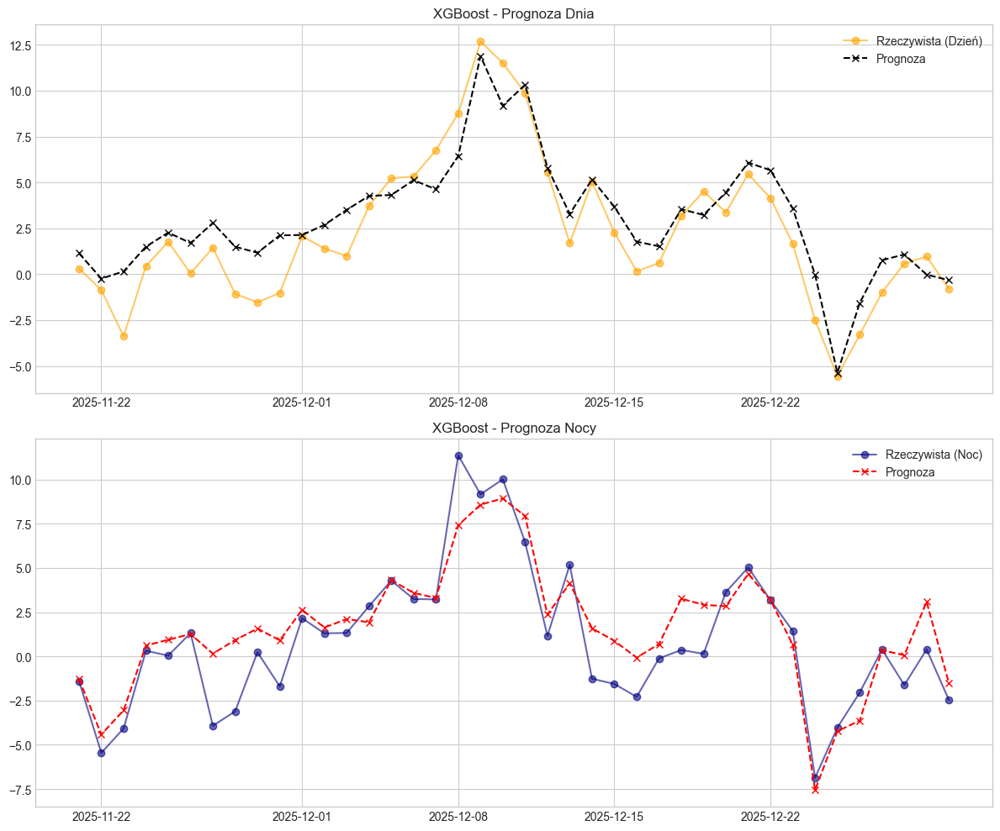

Predykcja temperatury XGBoost (v3)
==================================

### Wariant 3 wyniki

<!-- cmd: column_layout: [1, 1] -->
<!-- cmd: column: 0 -->
Feature importance (dzień)
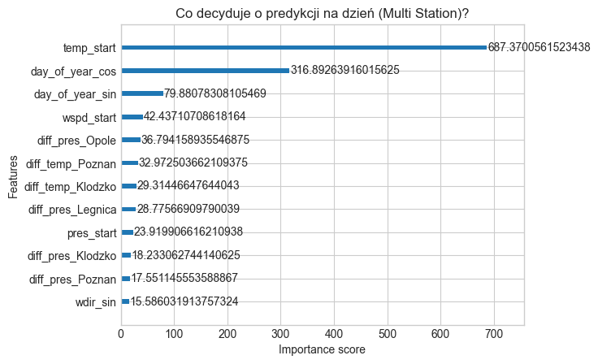

<!-- cmd: column: 1 -->
Feature importance (noc)

<!-- cmd: reset_layout -->

Predykcja temperatury XGBoost (v3)
==================================

### Wariant 3 wyniki

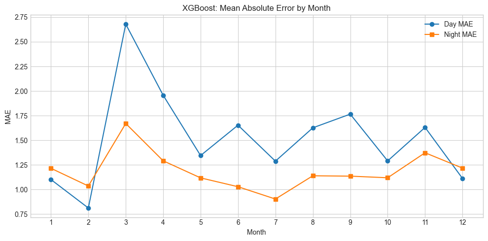

Predykcja temperatury SARIMAX
=============================

Parametry modelu: `(p, d, q) x (P, D, Q, s)`. Małe litery odnoszą się do pojedyńczych przeszłych obserwacji a duże do cykli.

- **s (Seasonality):** Długość cyklu. Tu cykl dobowy, ale `s` zależy od resamplingu (dla danych co 3h, s=8, bo 8*3=24h).
- **AR (p/P): autoregressive.** Patrzymy wstecz. Bieżąca wartość jest **liniową kombinacją p poprzednich obserwacji**. p - ile ostatnich obserwacji bierzemy pod uwagę. P - to samo, ale w skali sezonu (np ile ostatnich miesięcy).
- **I (d/D): integrated.** modeluje różnice między kolejnymi pomiarami, żeby usunąć trend.
- **MA (q/Q): moving average.** Uczenie się na błędach prognoz z poprzednich kroków. bieżąca obserwacja zależy od **q wcześniejszych błędów predykcji**
- **X (Exogenous):** Zmienne zewnętrzne (np. wilgotność, ciśnienie). muszą być znane w momencie prognozy.
<!-- cmd: column_layout: [1, 1] -->
<!-- cmd: column: 0 -->
Dla predykcji dzień/noc:

```py
(p,d,q)=(2, 0, 1),
(P,D,Q,s)=(0, 0, 1, 2), 
```
<!-- cmd: column: 1 -->
Dla gęstszych:

```py
(p,d,q)=(3, 0, 1),
(P,D,Q,s)=(1, 0, 1, s), # s= 24 / resample_rate
```
<!-- cmd: reset_layout -->

Wybierane metodą prób i błędów, nie było szczególnie dużo opcji, bo użycie gdziekolwiek więcej niż 4 sprawiało że trening trwa bardzo długo.

Predykcja temperatury SARIMAX
=============================

**Stworzone kolumny exogeniczne:**

- `climatology` - średnia temperatura z przeszłości dla tego konkretnego dnia w roku (expanding mean).
- `day_year_sin` / `day_year_cos` - cykliczna reprezentacja daty
- `pres_lag1`, `rhum_lag1`, `clcd_lag1` - wartość ciśnienia/wilgotności/zachmurzenia z *poprzedniego* kroku.
- `pres_trend` - różnica ciśnienia między wartością sprzed 1 a 2 kroków.
- `dew_point_approx_lag1` - punkt rosy (funkcja temperatury i wilgotności)

Predykcja temperatury SARIMAX
=============================

- Prognoza `get_forecast` generuje prognozę rekurencyjnie na kolejne kroki czasowe startując od ostatniego rekordu w zbiorze treningowym (korzysta z tego co przewidział wcześniej ale nie korzysta z prawdziwych y_test z przeszłości)
- Jak chcemy prognozować na długi czas to trzeba jej dokładać prawdziwe dane dla dni które już przewidział

<!-- (poprawione teraz, w odesłanym projekcie tego nie ma) -->

<!-- ```py
preds = []
for t in range(len(y_test)):
    # 1-krokowa prognoza
    fc = res.get_forecast(steps=1, exog=exog_test[t:t+1])
    preds.append(fc.predicted_mean.iloc[0])

    # dokarmienie MODELU prawdziwym y_test[t]
    res = res.append(
        y_test[t:t+1],
        exog=exog_test[t:t+1],
        refit=False
    )
``` -->

Predykcja temperatury SARIMAX
=============================

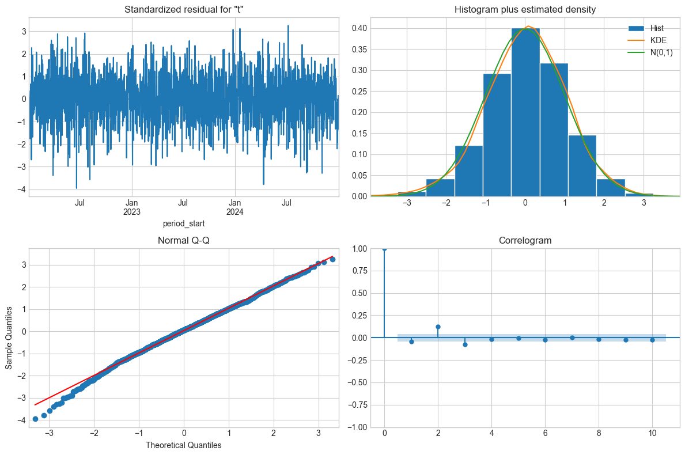

- 1 - czy reszty nie mają struktury w czasie
- 2 i 3 - porównanie z rozkładem normalnym
- 4 - czy reszty nie są skorelowanie w czasie (x - opóźnienie, y - korelacja)

Predykcja temperatury SARIMAX
=============================

### SARIMAX dzień i noc (resampling po 12h)

```txt
[DAY  ] RMSE: 2.72, MAE: 2.12, R2: 0.89
[NIGHT] RMSE: 2.19, MAE: 1.76, R2: 0.90
```

Predykcja temperatury SARIMAX
=============================

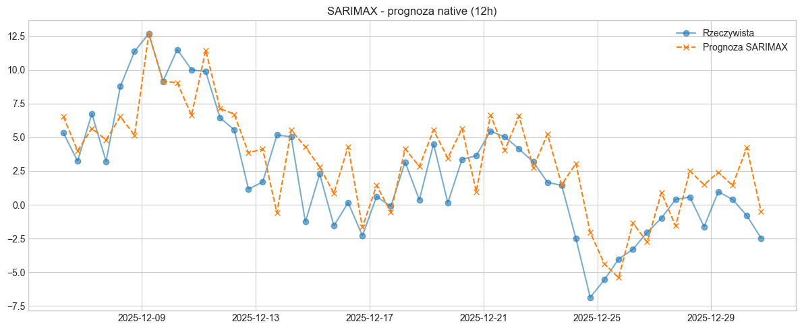

Predykcja temperatury SARIMAX
=============================

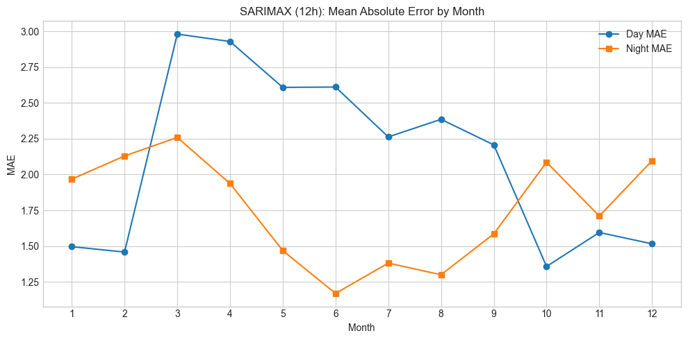

SARIMAX - predykcje w krótszych interwałach (dodatek)
=====================================================

Co 4h

```txt
RMSE: 1.5904   MAE: 1.2061   R2: 0.9616
```

Co 3h

```txt
RMSE: 1.3792   MAE: 1.0479   R2: 0.9713
```

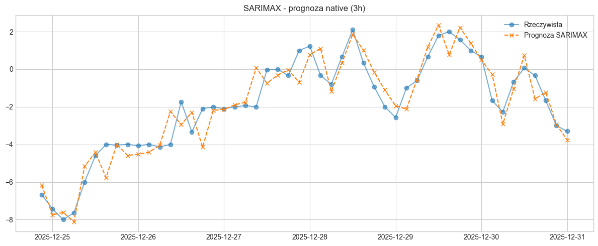

Prognoza temperatury - podsumowanie
===================================

```txt
Baseline
1: Persistence
[Day  ] RMSE: 2.87, MAE: 2.22, R2: 0.89
[Night] RMSE: 2.96, MAE: 2.31, R2: 0.83
2: Monthly Average
[Day  ] RMSE: 4.21, MAE: 3.44, R2: 0.76
[Night] RMSE: 3.77, MAE: 3.01, R2: 0.73

XGBoost
 wariant 1
[DAY  ] RMSE: 2.67, MAE: 2.11, R2: 0.8954
[NIGHT] RMSE: 1.48, MAE: 1.15, R2: 0.9545
 wariant 2
[DAY  ] RMSE: 2.36, MAE: 1.85, R2: 0.9180
[NIGHT] RMSE: 1.46, MAE: 1.11, R2: 0.9556
 wariant 3
[DAY  ] RMSE: 1.97, MAE: 1.53, R2: 0.9427
[NIGHT] RMSE: 1.50, MAE: 1.19, R2: 0.9531

SARIMAX
[DAY  ] RMSE: 2.72, MAE: 2.12, R2: 0.89
[NIGHT] RMSE: 2.19, MAE: 1.76, R2: 0.90
```

Deszcz
======

- dane od 2022 (bo wcześniej nie rejestrowano deszczu)
- ostatni rok w danych to test
- porównujemy precision i recall dla predykcji że będzie deszcz

Deszcz - modele baseline
========================

1. będzie tak jak wczoraj

```txt
         precision    recall  f1-score   support
    1.0      0.647     0.647     0.647       170
```

2. losowo, prawdopodobieństwo deszczu 50%

```txt
         precision    recall  f1-score   support
    1.0      0.453     0.482     0.467       170
```

3. losowo, prawdopodobieństwo deszczu proporcjonalne do udziału dni z deszczem w zbiorze treningowym

```txt
         precision    recall  f1-score   support
    1.0      0.489     0.529     0.508       170
```

4. losowo, prawdopodobieństwo deszczu proporcjonalne do udziału dni z deszczem w zbiorze treningowym w danym miesiącu

```txt
         precision    recall  f1-score   support
    1.0      0.511     0.541     0.526       170
```

Deszcz - features
=================

**Stan aktualny (z godz. 23:00 dnia poprzedniego):**

- `temp` - temperatura powietrza o 23:00.
- `pres` - ciśnienie atmosferyczne o 23:00.
- `rhum` - wilgotność względna o 23:00.
- `wspd` - prędkość wiatru o 23:00.

**Opady u sąsiadów `["Legnica", "Opole", "Poznan", "Klodzko"]` (cechy binarne):**

- `neighbor_rain_6h_<city>` - czy u sąsiada wystąpił opad w ciągu ostatnich 6 godzin.
- `neighbor_rain_12h_<city>` - czy u sąsiada wystąpił opad w ciągu ostatnich 12 godzin.

**Inne:**

- `prcp_1d` - suma opadów z poprzedniego dnia.
- `rain_yesterday_any` - binarna informacja, czy wczoraj wystąpił jakikolwiek opad.
- `wdir_sin` - sinus kierunku wiatru (stopnie → radiany).
- `wdir_cos` - cosinus kierunku wiatru.
- `dew_point` - przybliżony punkt rosy, liczony z temperatury i wilgotności względnej.
- `rhum_rise_3h` - zmiana wilgotności względnej w ciągu ostatnich 3 godzin (wzrost/spadek).
- `doy_sin` - składowa sinusoidalna dnia roku (kodowanie cykliczne).
- `doy_cos` - składowa cosinusoidalna dnia roku (kodowanie cykliczne).

Deszcz - XGBoost
================

```txt
              precision    recall  f1-score   support
         1.0      0.675     0.659     0.667       170
```

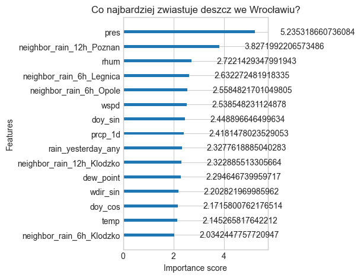

Deszcz - RandomForest
=====================

```txt
              precision    recall  f1-score   support
         1.0      0.687     0.659     0.673       170
```

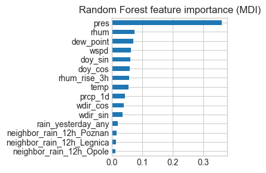

Deszcz - AdaBoost
=================

```txt
              precision    recall  f1-score   support
         1.0      0.644     0.682     0.663       170
```

Deszcz - użyte cechy
====================

Permutation importance mierzy, jak bardzo pogarsza się jakość modelu, gdy zniszczysz informację niesioną przez jedną cechę, losowo ją permutując.


<!-- 
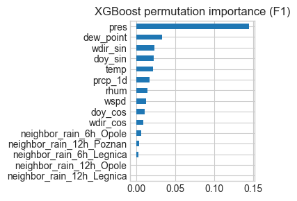

---

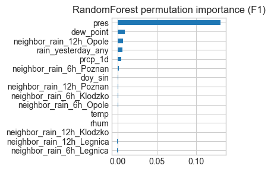

---

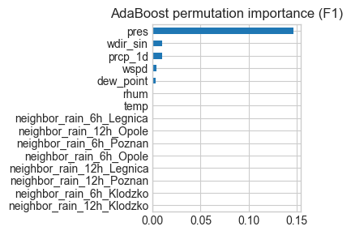 -->

Deszcz - podsumowanie
=====================

```txt
Tak jak wczoraj
            precision    recall  f1-score   support
        1.0      0.647     0.647     0.647       170


Losowo z rozkładem ppb na podstawie przeszłych danych per miesiąc
             precision    recall  f1-score   support
        1.0      0.511     0.541     0.526       170

XGBoost
              precision    recall  f1-score   support
         1.0      0.675     0.659     0.667       170

RandomForest
              precision    recall  f1-score   support
         1.0      0.687     0.659     0.673       170

AdaBoost
              precision    recall  f1-score   support
         1.0      0.644     0.682     0.663       170
```
